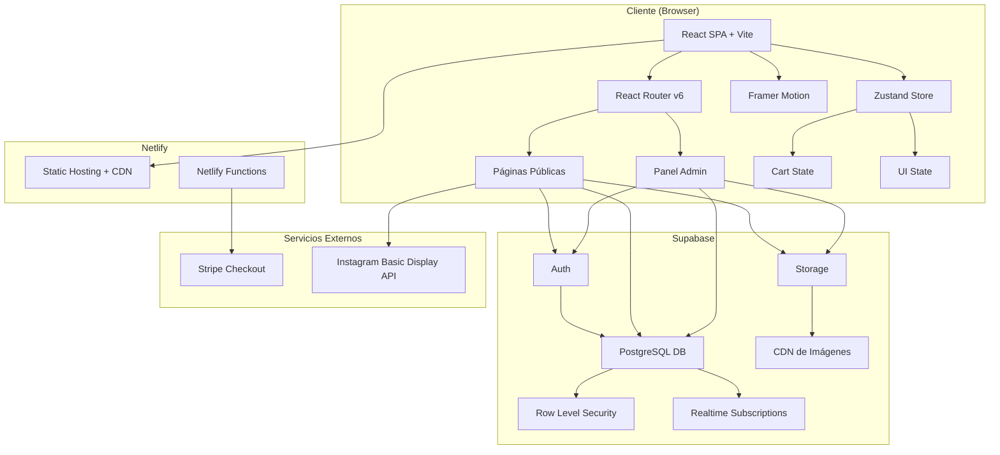
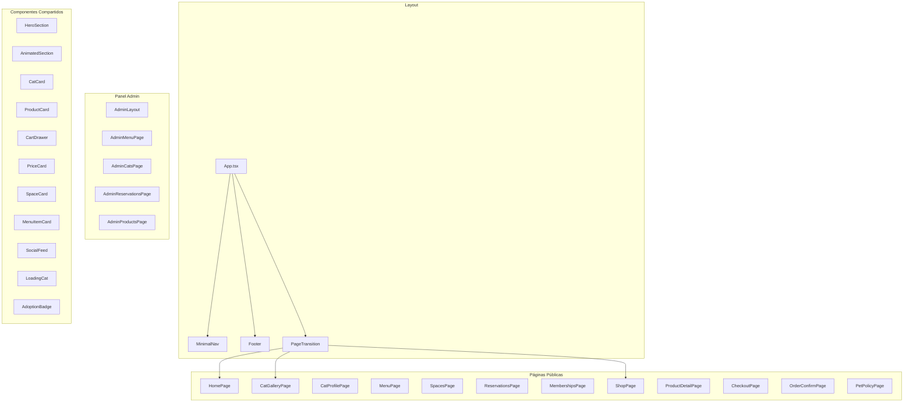
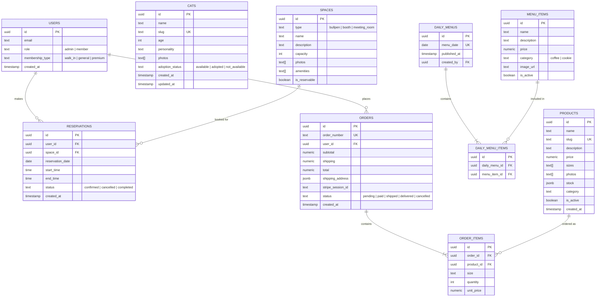

# Documento de Diseño — Catwork Website

## Resumen

Este documento describe el diseño técnico del sitio web de Catwork, un espacio de coworking y cafetería cat-friendly en Hermosillo, México. El sitio combina una experiencia visual editorial inspirada en [thecoffee.jp](https://thecoffee.jp/) — imágenes a pantalla completa, tipografía grande, navegación mínima y transiciones suaves — con funcionalidades de negocio como reservaciones, tienda de merchandising, menú diario y panel de administración.

### Decisiones Técnicas Clave

| Decisión | Elección | Justificación |
|---|---|---|
| Framework Frontend | React 18 + Vite | Requisito del cliente. Vite ofrece HMR rápido y builds optimizados. |
| Animaciones | Framer Motion (Motion) | API declarativa nativa de React, soporte para `prefers-reduced-motion`, scroll animations, y exit transitions. Ideal para la estética editorial requerida. |
| Backend / BaaS | Supabase | PostgreSQL relacional (ideal para reservaciones, inventario, relaciones entre entidades), auth integrado, storage para imágenes, real-time subscriptions, tier gratuito generoso, y sin vendor lock-in. |
| Pagos | Stripe + @stripe/react-stripe-js | Soporte nativo para MXN, Stripe Checkout para flujo seguro, cumplimiento PCI sin manejar datos de tarjeta directamente. |
| Estilos | Tailwind CSS | Utility-first para prototipado rápido, sistema de diseño consistente, purge automático para bundles pequeños. |
| Routing | React Router v6 | Estándar de la industria para SPAs React, lazy loading de rutas nativo. |
| Estado Global | Zustand | Ligero (~1KB), sin boilerplate, ideal para carrito de compras y estado de UI. |
| Despliegue | Netlify | Requisito del cliente. CI/CD desde repositorio, Netlify Functions para endpoints serverless (Stripe webhooks, etc.). |
| Hosting de Imágenes | Supabase Storage | CDN integrado, transformaciones de imagen, políticas de acceso granulares. |

### Referencia Visual

El sitio de thecoffee.jp utiliza un diseño editorial con las siguientes características que adoptaremos:
- **Hero a pantalla completa** con imágenes de alta calidad y texto superpuesto
- **Navegación mínima** que no compite con el contenido visual
- **Scroll-driven storytelling** donde cada sección se revela con animaciones suaves
- **Tipografía grande y expresiva** como elemento de diseño principal
- **Transiciones entre secciones** con fade-in y parallax sutil
- **Paleta de colores cálida** con mucho espacio en blanco

---

## Arquitectura

### Diagrama de Arquitectura General



### Patrón Arquitectónico

La aplicación sigue una arquitectura **SPA con BaaS (Backend-as-a-Service)**:

1. **Capa de Presentación**: React SPA con Framer Motion para animaciones y Tailwind CSS para estilos.
2. **Capa de Estado**: Zustand para estado local (carrito, UI), Supabase client para estado remoto con cache.
3. **Capa de Datos**: Supabase PostgreSQL con Row Level Security (RLS) para control de acceso.
4. **Capa de Servicios**: Netlify Functions como proxy seguro para operaciones sensibles (Stripe, webhooks).
5. **Capa de Almacenamiento**: Supabase Storage para imágenes con CDN integrado.

### Estructura de Rutas

```
/                       → Homepage
/gatos                  → Galería de gatos
/gatos/:slug            → Perfil individual de gato
/menu                   → Menú diario
/espacios               → Información de espacios
/reservaciones          → Sistema de reservaciones (requiere auth)
/membresias             → Página de membresías y precios
/tienda                 → Catálogo de merchandising
/tienda/:slug           → Detalle de producto
/tienda/checkout        → Proceso de pago
/tienda/confirmacion    → Confirmación de pedido
/politica-mascotas      → Política de mascotas
/admin                  → Panel de administración (protegido)
/admin/menu             → Gestión de menú
/admin/gatos            → Gestión de gatos
/admin/reservaciones    → Gestión de reservaciones
/admin/productos        → Gestión de merchandising
```

---

## Componentes e Interfaces

### Diagrama de Componentes



### Interfaces Principales

```typescript
// === Tipos de Dominio ===

interface Cat {
  id: string;
  name: string;
  slug: string;
  age: number;
  personality: string;
  photos: string[];        // URLs de Supabase Storage
  adoptionStatus: 'available' | 'adopted' | 'not_available';
  createdAt: string;
  updatedAt: string;
}

interface MenuItem {
  id: string;
  name: string;
  description: string;
  price: number;           // en MXN
  category: 'coffee' | 'cookie';
  imageUrl?: string;
  isActive: boolean;
}

interface DailyMenu {
  id: string;
  date: string;            // formato YYYY-MM-DD
  items: MenuItem[];
  publishedAt: string | null;
  createdBy: string;       // admin user id
}

interface Space {
  id: string;
  type: 'bullpen' | 'booth' | 'meeting_room';
  name: string;
  description: string;
  capacity: number;
  photos: string[];
  amenities: string[];
  isReservable: boolean;
}

interface Reservation {
  id: string;
  userId: string;
  spaceId: string;
  date: string;            // formato YYYY-MM-DD
  startTime: string;       // formato HH:mm
  endTime: string;         // formato HH:mm
  status: 'confirmed' | 'cancelled' | 'completed';
  createdAt: string;
}

interface Product {
  id: string;
  name: string;
  slug: string;
  description: string;
  price: number;           // en MXN
  sizes: string[];
  photos: string[];
  stock: Record<string, number>;  // { "S": 5, "M": 10, ... }
  category: string;
  isActive: boolean;
}

interface CartItem {
  productId: string;
  name: string;
  price: number;
  size: string;
  quantity: number;
  imageUrl: string;
}

interface Order {
  id: string;
  orderNumber: string;
  items: CartItem[];
  subtotal: number;
  shipping: number;
  total: number;
  shippingAddress: ShippingAddress;
  stripeSessionId: string;
  status: 'pending' | 'paid' | 'shipped' | 'delivered' | 'cancelled';
  createdAt: string;
}

interface ShippingAddress {
  fullName: string;
  street: string;
  city: string;
  state: string;
  zipCode: string;
  phone: string;
}

interface MembershipPlan {
  id: string;
  name: string;
  type: 'walk_in' | 'general' | 'premium';
  price: number;
  period: 'one_time' | 'monthly';
  benefits: string[];
  isHighlighted: boolean;
}

// === Interfaces de Componentes ===

interface HeroSectionProps {
  imageUrl: string;
  title: string;
  subtitle?: string;
  overlayOpacity?: number;
  height?: 'full' | 'half';
}

interface AnimatedSectionProps {
  children: React.ReactNode;
  animation?: 'fadeIn' | 'slideUp' | 'slideLeft' | 'parallax';
  delay?: number;
  className?: string;
}

interface CatCardProps {
  cat: Cat;
  onClick: (slug: string) => void;
}

interface ProductCardProps {
  product: Product;
  onAddToCart: (product: Product, size: string) => void;
}

// === Store (Zustand) ===

interface CartStore {
  items: CartItem[];
  isOpen: boolean;
  addItem: (item: CartItem) => void;
  removeItem: (productId: string, size: string) => void;
  updateQuantity: (productId: string, size: string, quantity: number) => void;
  clearCart: () => void;
  toggleCart: () => void;
  getTotal: () => number;
  getItemCount: () => number;
}
```

### Componentes Clave

#### MinimalNav
Navegación inspirada en thecoffee.jp: logo a la izquierda, menú hamburguesa a la derecha que despliega un overlay a pantalla completa con las opciones de navegación. En desktop, links mínimos visibles. Transparente sobre el hero, con fondo sólido al hacer scroll.

#### PageTransition
Wrapper que usa `AnimatePresence` de Framer Motion para animar transiciones entre rutas. Cada página entra con fade-in y sale con fade-out.

#### HeroSection
Imagen a pantalla completa (100vh) con overlay de gradiente, texto centrado con tipografía grande, y efecto parallax sutil al hacer scroll.

#### AnimatedSection
Componente reutilizable que usa `useInView` de Framer Motion para activar animaciones cuando el elemento entra al viewport. Respeta `prefers-reduced-motion`.

#### LoadingCat
Animación de carga con temática felina (silueta de gato animada) que se muestra durante la carga inicial del sitio.

#### CartDrawer
Panel lateral (drawer) que se desliza desde la derecha mostrando los productos en el carrito, cantidades editables y total. Botón para proceder al checkout.

---

## Modelos de Datos

### Diagrama Entidad-Relación



### Políticas de Seguridad (Row Level Security)

| Tabla | Operación | Política |
|---|---|---|
| `cats` | SELECT | Público (todos pueden leer) |
| `cats` | INSERT/UPDATE/DELETE | Solo rol `admin` |
| `menu_items` | SELECT | Público |
| `menu_items` | INSERT/UPDATE/DELETE | Solo rol `admin` |
| `daily_menus` | SELECT | Público |
| `daily_menus` | INSERT/UPDATE/DELETE | Solo rol `admin` |
| `spaces` | SELECT | Público |
| `reservations` | SELECT | Usuario autenticado ve las suyas; admin ve todas |
| `reservations` | INSERT | Usuarios con `membership_type = 'premium'` |
| `reservations` | UPDATE/DELETE | Solo rol `admin` |
| `products` | SELECT | Público |
| `products` | INSERT/UPDATE/DELETE | Solo rol `admin` |
| `orders` | SELECT | Usuario ve las suyas; admin ve todas |
| `orders` | INSERT | Cualquier usuario autenticado |

### Supabase Storage Buckets

| Bucket | Acceso | Contenido |
|---|---|---|
| `cat-photos` | Público lectura, admin escritura | Fotografías de gatos |
| `product-photos` | Público lectura, admin escritura | Fotos de merchandising |
| `menu-photos` | Público lectura, admin escritura | Fotos de productos del menú |
| `space-photos` | Público lectura, admin escritura | Fotos de espacios |
| `brand-assets` | Público lectura | Logo, íconos, assets de marca |


---

## Propiedades de Correctitud

*Una propiedad es una característica o comportamiento que debe mantenerse verdadero en todas las ejecuciones válidas de un sistema — esencialmente, una declaración formal sobre lo que el sistema debe hacer. Las propiedades sirven como puente entre especificaciones legibles por humanos y garantías de correctitud verificables por máquina.*

### Propiedad 1: La galería renderiza todos los gatos con foto y nombre

*Para cualquier* lista de objetos Cat, el componente de galería debe renderizar exactamente una tarjeta por gato, y cada tarjeta debe contener el nombre del gato y al menos una imagen.

**Valida: Requisito 3.1**

### Propiedad 2: El perfil de gato muestra todos los campos requeridos

*Para cualquier* objeto Cat válido, la página de perfil debe incluir en su salida renderizada el nombre, al menos 3 fotografías, la descripción de personalidad, la edad y el estado de adopción.

**Valida: Requisito 3.3**

### Propiedad 3: El indicador de adopción es condicional al estado

*Para cualquier* objeto Cat, el indicador de disponibilidad para adopción y el enlace de contacto deben ser visibles si y solo si `adoptionStatus === 'available'`.

**Valida: Requisito 3.4**

### Propiedad 4: Los items del menú muestran nombre, descripción y precio

*Para cualquier* objeto MenuItem válido, la tarjeta renderizada debe contener el nombre del producto, su descripción y el precio formateado en MXN.

**Valida: Requisito 4.2**

### Propiedad 5: La autorización de reservaciones depende del tipo de membresía

*Para cualquier* usuario y cualquier espacio reservable, la solicitud de reservación debe ser aceptada si y solo si el usuario tiene `membership_type === 'premium'`. Usuarios sin membresía premium deben recibir un mensaje indicando que se requiere Membresía Premium.

**Valida: Requisitos 5.3, 5.4**

### Propiedad 6: Las reservaciones con conflicto de horario son rechazadas

*Para cualquier* espacio con una reservación existente, un intento de reservar un horario que se solape (parcial o totalmente) con la reservación existente debe ser rechazado, y el sistema debe sugerir horarios alternativos disponibles.

**Valida: Requisito 5.5**

### Propiedad 7: Las tarjetas de producto muestran todos los campos requeridos

*Para cualquier* objeto Product válido, la tarjeta de producto debe renderizar foto, nombre, descripción, precio en MXN y las tallas disponibles.

**Valida: Requisito 7.1**

### Propiedad 8: El carrito se actualiza correctamente al agregar productos

*Para cualquier* producto válido con stock disponible y cualquier cantidad positiva, agregar el producto al carrito debe incrementar el conteo de items y actualizar el total del carrito en exactamente `precio × cantidad` del producto agregado.

**Valida: Requisito 7.2**

### Propiedad 9: Los productos sin inventario no pueden agregarse al carrito

*Para cualquier* producto donde `stock[size] === 0` para la talla seleccionada, el sistema debe impedir la adición al carrito y mostrar el producto como "agotado" para esa talla.

**Valida: Requisito 7.7**

### Propiedad 10: El panel de administración es inaccesible para usuarios no-admin

*Para cualquier* usuario cuyo rol no sea `admin`, el intento de acceder a cualquier ruta del Panel_Admin debe ser denegado y redirigido a la página de login o a la homepage.

**Valida: Requisito 8.7**

### Propiedad 11: Todas las imágenes tienen texto alternativo

*Para cualquier* imagen renderizada en el sitio, el atributo `alt` debe estar presente y contener texto descriptivo no vacío.

**Valida: Requisito 11.2**

### Propiedad 12: Las animaciones respetan prefers-reduced-motion

*Para cualquier* componente AnimatedSection, cuando la preferencia del sistema `prefers-reduced-motion` está configurada como `reduce`, las animaciones deben estar desactivadas o reducidas a transiciones instantáneas.

**Valida: Requisito 11.4**

---

## Manejo de Errores

### Estrategia General

El sitio implementa un enfoque de manejo de errores en capas:

| Capa | Estrategia | Implementación |
|---|---|---|
| **Red / API** | Retry con backoff exponencial + fallback UI | Hook `useQuery` con configuración de retry. Mensajes amigables al usuario. |
| **Autenticación** | Redirect a login + mensaje contextual | Middleware de rutas protegidas. Token refresh automático. |
| **Validación de formularios** | Validación en tiempo real + mensajes inline | Zod schemas + react-hook-form. Validación client-side antes de enviar. |
| **Pagos (Stripe)** | Manejo de errores de Stripe + estados de UI | Stripe Elements maneja errores de tarjeta. Netlify Function maneja errores de API. |
| **Carga de imágenes** | Placeholder + lazy loading con fallback | Componente Image con estado de error que muestra placeholder temático. |
| **Errores inesperados** | Error Boundary global + página de error | React Error Boundary con UI amigable y opción de recargar. |

### Errores Específicos por Módulo

#### Reservaciones
- **Conflicto de horario**: Mostrar horarios alternativos disponibles (Propiedad 6).
- **Membresía insuficiente**: Mostrar mensaje con enlace a página de membresías (Propiedad 5).
- **Error de red al reservar**: Guardar intento localmente y reintentar. Nunca crear reservación duplicada.

#### Tienda / Carrito
- **Producto agotado durante checkout**: Verificar stock antes de crear sesión de Stripe. Notificar al usuario si el stock cambió.
- **Error de pago**: Mostrar mensaje de Stripe localizado en español. No crear orden hasta confirmación de webhook.
- **Sesión de Stripe expirada**: Redirigir al carrito con mensaje explicativo.

#### Panel Admin
- **Sesión expirada**: Redirect a login con mensaje "Tu sesión ha expirado".
- **Error al subir imagen**: Mostrar error con opción de reintentar. Validar tamaño y formato antes de subir (max 5MB, JPG/PNG/WebP).
- **Conflicto de edición concurrente**: Usar `updated_at` para detectar conflictos y notificar al admin.

#### Carga de Datos
- **Supabase no disponible**: Mostrar página de mantenimiento con temática felina.
- **Instagram API no disponible**: Ocultar sección de feed social sin afectar el resto de la página.
- **Menú del día no publicado**: Mostrar mensaje "El menú del día estará disponible próximamente" (Requisito 4.5).

---

## Estrategia de Testing

### Enfoque Dual: Tests Unitarios + Tests de Propiedades

El proyecto utiliza un enfoque dual de testing que combina tests unitarios/de ejemplo para casos específicos con tests basados en propiedades para verificar comportamiento universal.

### Herramientas

| Herramienta | Propósito |
|---|---|
| **Vitest** | Test runner principal, compatible con Vite |
| **React Testing Library** | Testing de componentes React |
| **fast-check** | Property-based testing para JavaScript/TypeScript |
| **MSW (Mock Service Worker)** | Mocking de APIs (Supabase, Stripe, Instagram) |
| **axe-core / vitest-axe** | Testing de accesibilidad automatizado |
| **Playwright** | Tests E2E y cross-browser |

### Tests Basados en Propiedades (PBT)

Cada propiedad de correctitud se implementa como un test con `fast-check`:

- **Mínimo 100 iteraciones** por propiedad
- Cada test referencia su propiedad del documento de diseño
- Formato de tag: **Feature: catwork-website, Property {número}: {título}**

**Propiedades a implementar con PBT:**

| Propiedad | Módulo | Generador Principal |
|---|---|---|
| 1: Galería renderiza todos los gatos | Gatos | `fc.array(arbitraryCat())` |
| 2: Perfil muestra campos requeridos | Gatos | `arbitraryCat()` |
| 3: Indicador de adopción condicional | Gatos | `arbitraryCat()` con status variable |
| 4: Items del menú muestran campos | Menú | `arbitraryMenuItem()` |
| 5: Autorización de reservaciones | Reservaciones | `arbitraryUser()` × `arbitrarySpace()` |
| 6: Conflicto de horario rechazado | Reservaciones | `arbitraryReservation()` × `arbitraryTimeSlot()` |
| 7: Tarjetas de producto completas | Tienda | `arbitraryProduct()` |
| 8: Carrito se actualiza correctamente | Tienda | `arbitraryProduct()` × `fc.integer({min:1, max:10})` |
| 9: Productos agotados bloqueados | Tienda | `arbitraryProduct({stock: 0})` |
| 10: Admin inaccesible para no-admin | Auth | `arbitraryUser({role: 'member'})` × `arbitraryAdminRoute()` |
| 11: Imágenes con alt text | Accesibilidad | `arbitraryCat()` / `arbitraryProduct()` |
| 12: Animaciones respetan reduced-motion | Accesibilidad | `arbitraryAnimationProps()` |

### Tests Unitarios / de Ejemplo

Tests específicos para casos concretos y edge cases:

- **Homepage**: Verifica que las secciones de preview (gatos, menú, espacios, merch) se renderizan
- **Navegación**: Verifica que los links sociales abren en nueva pestaña con `target="_blank"`
- **Menú sin publicar**: Verifica mensaje fallback cuando no hay menú del día
- **Login admin**: Verifica redirect en credenciales incorrectas
- **Checkout**: Verifica que el formulario de envío y método de pago están presentes
- **Confirmación de orden**: Verifica que se muestra número de orden y resumen
- **Política de mascotas**: Verifica que el aviso de no-perros es visible
- **Animaciones**: Verifica que las duraciones están entre 300ms y 800ms
- **Lazy loading**: Verifica que imágenes usan `loading="lazy"` y rutas usan `React.lazy()`

### Tests de Integración

- **Supabase CRUD**: Operaciones de admin sobre gatos, menú, productos, reservaciones
- **Stripe Checkout**: Creación de sesión de pago con Netlify Function (mock)
- **Real-time updates**: Cambios en admin reflejados en páginas públicas
- **Instagram feed**: Renderizado del feed con datos mock

### Tests E2E (Playwright)

- Flujo completo de compra: navegar tienda → agregar al carrito → checkout → confirmación
- Flujo de reservación: login → seleccionar espacio → reservar → confirmación
- Navegación general: homepage → gatos → perfil → volver
- Accesibilidad: navegación completa por teclado
- Cross-browser: Chrome, Firefox, Safari, Edge (últimas 2 versiones)

### Tests de Rendimiento

- Lighthouse CI en pipeline de despliegue (score ≥ 90 en móvil)
- Bundle size monitoring con `vite-plugin-inspect`
- Core Web Vitals tracking

### Cobertura Objetivo

| Tipo | Cobertura |
|---|---|
| Lógica de negocio (carrito, reservaciones, auth) | ≥ 90% |
| Componentes UI | ≥ 80% |
| Utilidades y helpers | ≥ 95% |
| Rutas de admin | ≥ 85% |
